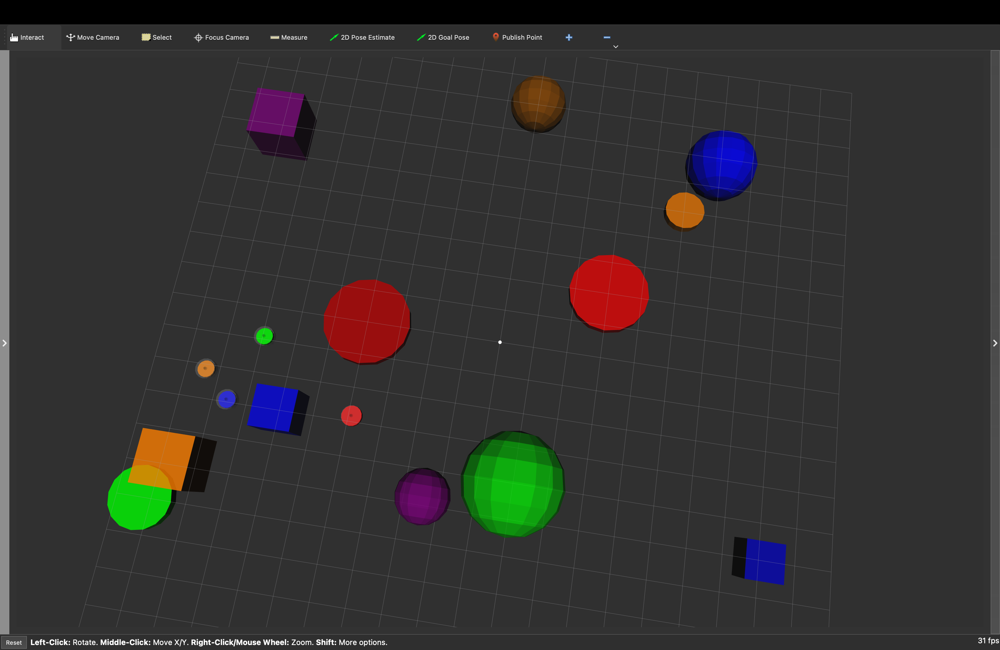

# Modern Swarm Leader-Follower System

A multi-robot leader-follower swarm system implemented in Python and ROS2, featuring computer vision, obstacle avoidance, and multiple control strategies.



## Project Overview

This project demonstrates the evolution of a swarm robotics system from standalone Python implementation to a full ROS2-based deployment. The system enables coordinated movement of multiple robots following a designated leader while maintaining formation patterns and avoiding obstacles.

## Development Journey

### Phase 1: Standalone Python Implementation
The project began with standalone Python demos in `demos/python/` that implemented:
- Basic leader-follower algorithms
- Multiple formation patterns (line, circle, triangle, square)
- MPC (Model Predictive Control) controller implementation
- Simple obstacle avoidance
- Performance monitoring and visualization

### Phase 2: ROS2 Integration
The system was then ported to ROS2 for real-world deployment capabilities:
- Unified ROS2 node architecture
- Modular design with separate components
- ROS2 services for interactive control
- Real-time performance monitoring
- Computer vision integration for leader tracking

## System Architecture

### Core Components

#### Unified ROS2 Node (`unified_swarm_ros2.py`)
- Main system orchestrator
- Manages robot states and formations
- Handles service requests and topic publishing
- Integrates all subsystems

#### Control Modules
- **Controllers** (`controllers.py`): PID and MPC control implementations
- **Vision** (`vision.py`): Computer vision for leader detection and tracking
- **Obstacles** (`obstacles.py`): Obstacle detection and avoidance algorithms
- **Interactive** (`interactive.py`): Service-based control interface
- **Data Logging** (`data_logging.py`): Performance monitoring and metrics
- **Plotter** (`plotter.py`): Real-time visualization and analysis

#### Formation Patterns
The system supports multiple formation patterns as shown in the diagram above:
- Line formation
- Circle formation  
- Triangle formation
- Square formation
- Custom formation support

### Communication Architecture

#### ROS2 Topics
- `/swarm/robot_positions` - Robot position updates
- `/swarm/formation_status` - Formation state information
- `/swarm/performance_metrics` - System performance data
- `/swarm/visualization_markers` - RViz visualization markers

#### ROS2 Services
- `/swarm/set_formation` - Change formation pattern
- `/swarm/set_controller` - Switch between PID and MPC controllers
- `/swarm/toggle_vision` - Enable/disable vision system
- `/swarm/toggle_obstacle_avoidance` - Enable/disable obstacle avoidance
- `/swarm/add_obstacle` - Add dynamic obstacles

## Key Features

### Multi-Robot Coordination
- Leader-follower dynamics with configurable formations
- Real-time position tracking and adjustment
- Collision avoidance between swarm members

### Computer Vision Integration
- Leader detection and tracking
- Real-time position estimation
- Vision-based formation control

### Obstacle Avoidance
- Dynamic obstacle detection
- Path planning and collision avoidance
- Integration with formation maintenance

### Performance Monitoring
- Real-time metrics collection
- Formation error tracking
- Collision statistics
- Performance visualization and analysis

### Interactive Control
- Service-based control interface
- Runtime parameter adjustment
- Formation pattern switching
- Controller selection

## Project Structure

```
modern_swarm_leader_follower/
├── demos/
│   ├── python/          # Standalone Python implementations
│   │   ├── mpc_controller.py     # MPC implementation
│   │   ├── swarm_core.py         # Core swarm algorithms
│   │   └── [other demo files]
│   └── ros2/            # ROS2 feature demonstrations
│       ├── ros2_swarm_bridge_with_services.py
│       ├── vision_leader_follower_ros2.py
│       ├── obstacle_avoidance_ros2.py
│       ├── multi_follower_ros2.py
│       └── clean_start.py
├── ros2_workspace/
│   └── src/modern_swarm/ # Main ROS2 package
│       ├── scripts/      # Core system modules
│       │   ├── unified_swarm_ros2.py  # Main system
│       │   ├── controllers.py         # Control algorithms
│       │   ├── vision.py              # Vision system
│       │   ├── obstacles.py           # Obstacle avoidance
│       │   ├── interactive.py         # Interactive control
│       │   ├── data_logging.py        # Performance monitoring
│       │   └── plotter.py             # Visualization
│       ├── launch/       # Launch files
│       ├── config/       # Configuration files
│       └── urdf/         # Robot models
├── run_swarm_ros2_demo.sh      # Main demo script
├── run_swarm_static_transforms.sh # Static transforms
└── requirements.txt     # Python dependencies
```

## Quick Start

### Prerequisites
- ROS2 (tested with conda-based installation)
- Python 3.8+
- Required Python packages (see `requirements.txt`)

### Running the System

1. **Build the ROS2 workspace:**
   ```bash
   cd ros2_workspace
   colcon build
   source install/setup.bash
   ```

2. **Run the main demo:**
   ```bash
   ./run_swarm_ros2_demo.sh
   ```

3. **Launch RViz for visualization:**
   ```bash
   ros2 launch modern_swarm unified_swarm_rviz.launch.py
   ```

### Interactive Control

The system provides ROS2 services for interactive control:

```bash
# Change formation pattern
ros2 service call /swarm/set_formation std_srvs/srv/SetBool "data: true"

# Switch to MPC controller
ros2 service call /swarm/set_controller std_srvs/srv/SetBool "data: true"

# Enable vision system
ros2 service call /swarm/toggle_vision std_srvs/srv/SetBool "data: true"
```

## Performance Analysis

The system includes comprehensive performance monitoring:
- Real-time formation error tracking
- Collision detection and statistics
- Performance metrics visualization
- Automated performance reports

Performance data and visualizations are stored in `ros2_workspace/performance_plots/`.

## Development Notes

### Build System
- Uses colcon build system for ROS2
- Python scripts are installed as ROS2 nodes
- Custom services use standard std_srvs/SetBool for compatibility

### Environment Setup
- Designed for conda-based ROS2 installation
- Includes environment setup scripts
- Handles Python path configuration for module imports

### Testing
- Individual feature demos in `demos/` folders
- Comprehensive unified system in `ros2_workspace/`
- Performance monitoring and validation tools

## Limitations and Future Work

### Current Limitations
- Limited to simulation environment (RViz/Gazebo)
- Basic obstacle avoidance implementation
- Vision system requires controlled lighting conditions
- Performance optimization needed for large swarms

### Potential Improvements
- Real robot hardware integration
- Advanced path planning algorithms
- Machine learning-based control strategies
- Distributed computing for large swarms
- Enhanced vision algorithms

## Contributing

See `CONTRIBUTING.md` for development guidelines and contribution process.

## License

[Add your license information here]

## Acknowledgments

This project demonstrates the practical application of swarm robotics concepts, from initial algorithm development in Python to deployment-ready ROS2 systems.
